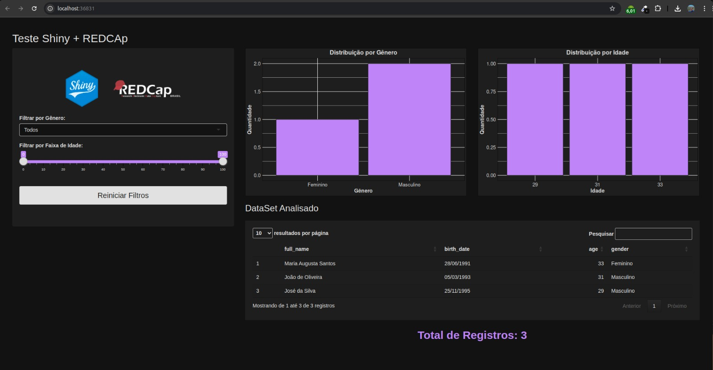

# shiny-redcap-test
Projeto apenas para fins de estudos :)



**Packages:**
Instale as bibliotecas necessárias:

```r
install.packages("shiny")
install.packages("dotenv")
install.packages("httr")
install.packages("jsonlite")
install.packages("DT")
install.packages("ggplot2")
```

**Variáveis de ambiente (.env):**
Crie um arquivo .env e inclua as seguintes variáveis relacionadas ao projeto REDCap:

```env
[REDCAP Configuration]
REDCAP_API_URL = 
REDCAP_API_KEY = 

```